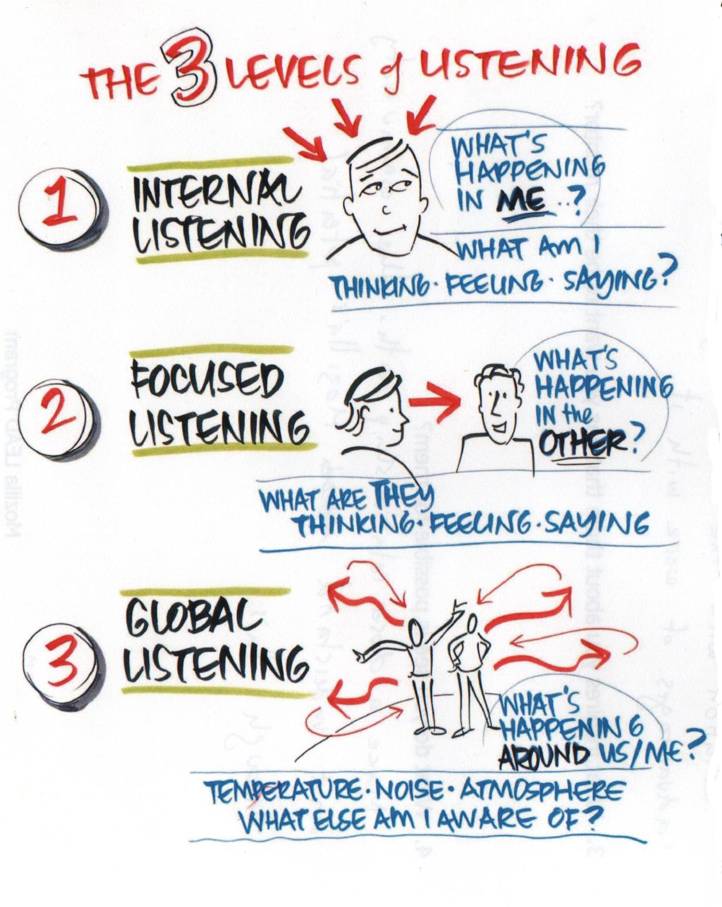
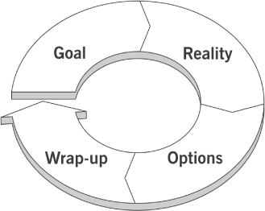
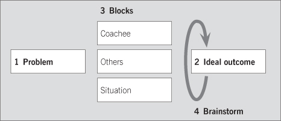

# A Coaching guide for Mozillians

### What is this guide?

Following Reps.Next proposal, we are changing the way *Mentorship* works on Reps program, and we will use the same framework to give **Coach** tools for Mozilla's leaders (a unified group between Reps mentors and Leadership Cohort). This is plan like a **guide** and **training** system to improve individual skillset on mozillians.

### Paradigm change

Until now, Mentor relationship in Reps is a hierarchical one, where you need that your mentor review and approve your request to continue. Help and training could be part of the relationship, but is not mandatory.

With Reps.Next we want to introduce a new way to work, where a Mentor become a Coach, a person that will help you find your way inside Mozilla and Reps program, through conversations.

At the same time, this relationship will be of one year. After that time, Coachee could ask for another coach (that will depend on her/his idea of what they want to accomplished in the coming months) or decide to continue with the same one.

## Differences between Mentor and Coach

> "There is a great man who makes every man feel small. But the real great man is the man who makes every man feel great." --G.K. Chesterton

The difference between “mentors” and “coaches” may not seem obvious. In fact, most people don’t even realize there is a distinction between the two.

A **coach** focuses on short-term development, with emphasis on enhancing current skills or on acquiring new skills. A **coach** does not share their personal concerns or experience, but rather proposes methods to enhance the *coachee's* understanding of their own self.

*Coachee* generally know what is the right or appropriate thing to do. Often your job is to **draw the answer out of the individual**. If you give the person the answer, she/he is less likely to own and fully enroll in the solution or answer.

Good coaches create a safe space to have an open discussion, ask the right questions (and genuinely listen to the answers), and constructively challenge.

When you coach, you aren’t just comparing stated objectives with a list of accomplishments. You’re helping people better understand the consequences of their actions and see when there is a disconnect between what they wanted to accomplish and what actually happened. It requires you be able to put yourself in their shoes and interpret various situations.

At a **Reps** level, we are changing the way that we work before. Rather than *helping* your mentee with her/his budget request, we want that you help your peers to challenge themselves to be better and have a personal development meanwhile they help Mozilla's mission.

Generally, a **coach/coachee** relationship is focus only on *personal development*. But we are working on Mozilla's context, so we will working not only on their skills, but how those skills function inside the organization and help advance the mission.

## Three levels of listening

Coaching is mostly made by conversations. Making the right questions so *coachee* could think, reflect and act. But to create the space for those conversations and make the best use of the time, we need to **listen in a special way**. Generally we talk about three different ways in which we could be listening what other people are saying.

### Level 1 - Internal listening

At Level 1, your awareness is on yourself. You listen to the words of the other person, but your attention is on what it means to you. The spotlight is on 'me': my thoughts, my judgments, my feelings, my opinions, an my conclusions. If this is the only kind of listening you’re doing in a conversation, others will often leave frustrated or disappointed, feeling neither seen nor heard.

### Level 2 - Focused listening

At Level 2, there is a sharp focus on the other person. Sometimes you can see it in each person's posture: both leaning forward, looking intently at each other. There is a great deal of attention on the other person and not much awareness of the outside world. You listen for the other's person words, meaning, challenges, emotions. you notice what they say and how they say it. Level 2 listening communicates empathy, clarification and collaboration.

It is the skill of being fully absorbed by the person in front of you, to the exclusion of all other things, including anything in Level 1. This doesn’t mean that Level 1 thoughts don’t come into your awareness. Of course they do! Rather, it means managing your Level 1 thoughts and reactions by quietly noting them and quickly setting them aside to keep your focus and curiosity on the other person.

In Level 2, you’re never thinking ahead to what you want to say next or what you’re going to ask. You stay with the person in this present moment, and trust that the conversation will take on a powerful flow of its own without you having to control it in one direction or another.

### Level 3 - Global listening

To listen at level 3 you must be open and ready to listen for information that may not be directly observable. You are listening to the people as well as the environment. It is sometimes described as environmental listening. It is the ability to read a room -the mood, the emotions, the unspoken information- and monitor how it changes in response to what you do. *Is there tension in the air? Is the conversation flat, or full of resonance? What are the primary emotions hanging in space between us? What’s hanging out there in the space between us that’s not being said?*.

There is a way you are conscious of underlying mood, or tone, or the impact of the conversation — where it is taking you and the person you are talking to.

The most effective coaching takes place when **the coach is at Level 2 and 3**. There will be times when coaches will drop into their own Level 1 place. As a coach, the key is to notice when you are listening at Level 1 and find your way back “over there” with the client. Sometimes all it takes is asking a provocative, curious question.

**Once you know the three levels, incorporating them into your life is simply a matter of practice.**

### Infographic

This image will help you to remember these three different levels:

Source: Co-Active Coaching By Laura Whitworth, Karen Kimsey-House, Henry Kimsey-House and Phillip Sandahl

### Links

* [The 3 levels of listening](http://michaelwarden.com/the-3-levels-of-listening/)
* [Co-Active coaching skills: Listening](http://www.thecoaches.com/learning-hub/fundamentals/res/FUN-Topics/FUN-Co-Active-Coaching-Skills-Listening.pdf)

## Structuring the coaching session: GROW

So, how do we actually structure a coaching session? The **GROW** (**G**oal, **R**eality, **O**ptions, **W**rap up) model is one of the most common coaching tools, widely used by many great coaches.

The framework provides a simple four step structure for a coaching session. During the first step of a session [Goal], coach and coachee agree on a specific topic and objective for the discussion. During the second step [Reality], both coach and coachee invite self assessment and offer specific examples to illustrate their points. They then move into the third step [Options], where suggestions are offered and choices made. And finally [Wrap up], the coach and coachee commit to action, define a timeframe for their objectives and identify how to overcome possible obstacles.

Here are a few tips for using this model:

* Use more ‘ask’ than ‘tell’; elicit useful ideas from your coachee – don’t just try to prove you are smart
* Think creatively – not just systematically, particularly in the Options and Wrap up steps
* Illustrate, and check understanding, throughout by using specific examples – from the coachee’s and your own experiences
* If you have a follow up session, you can obviously lengthen or shorten each of the four steps as needed

### The Grow Model

* Agree topic for discussion
* Agree specific objective of session
* Set long-term aim if appropriate
* Invite self-assessment
* Offer specific examples of feedback
* Avoid or check assumptions
* Discard irrelevant history
* Commit to action
* Identify possible obstacles
* Make steps specific and define timing
* Agree support
* Cover the full range of options
* Invite suggestions from the coachee
* Offer suggestions carefully
* Ensure choices are made

Each session could begin with a check in on what happen since the last meeting, what happen with decisions made, etc.

## How to run a super quick coaching session

Sometimes you do not have the time or knowledge to complete a full coaching discussion and really build someone’s skills, but you do want to help someone who is ‘stuck’ to complete the task in question.

Using the model shown opposite, you can achieve this in as little as five minutes by helping your coachees to see that they themselves have some responsibility for the situation and that there is something they can do, however small.

1. Ask the coachee to describe the current issue or problem, with specific examples and a small amount of relevant background.
2. Ask her/him to describe the outcome – paint as specific a ‘picture’ as possible of how things would be if s/he had sorted out the problem. Do not try to solve the problem, but note down any emerging ideas.
3. With the coachee, list all the obstacles/blocks that lie between 1 and 2. Sort them into three groups:
  * Blocks that exist in the coachee (lack of skill/knowledge, low motivation, attitude, etc.)
  * Blocks that exist in others (anxious customer, manager stressed and panicking, etc.)
  * Blocks in the situation (inadequate resources, shift in deadlines, etc.).
4. Jointly brainstorm ways around these blocks, and possible next steps. Agree an approach, actions and timing.

## The power of questions

Coaches sometimes offer suggestions to their coachees, and managers often issue instructions. But the most powerful coaching is non-directive: it is based on asking excellent questions – especially when there is a Gordian Knot of a predicament that cannot be untied, and so must be cut instead.

The power of the non-directive approach is confirmed by the findings of neuroscience.

* Coaching is usually employed when the coachee would perform better by doing something in a way that differs from the hitherto habitual way, or requires seeing something in a new light.

* Yet, when confronted with a new way of doing something (even if from a suggestion that is believed to be well-intentioned), the brain reacts adversely. Specifically, a region called the anterior cingulate cortex starts to register a conflict versus the brain’s existing schemas, and the amygdala sounds an alarm to resist.

* By asking an excellent question, the coachee’s alarm system is to some extent bypassed and his or her brain becomes engaged in a process of exploration rather than of defence.

The page opposite offers the coach a selection of ways in which to help the coachee explore issues from new and productive angles.

| Perspective: from … | Example coaching question |
| --------------------| --------------------------|
| Afar | Is this the right issue to be addressing? |
| Above (Super-Ego) | How would you explain this to a person strongly affected by your decision? |
| Left (logic) | What does your head tell you? |
| Right (emotion) | What does your heart tell you? |
| Behind (the past) | Which route is most consistent with your life/values/success formula so far? |
| In front (the future) | How does this fit with your picture of where you want to be? |
| Below (fears) |  Are you operating out of fear; is this good? |
| (Imagined) retrospect | Imagine you have already chosen the course of action – now tell me why you chose it? |
| Someone else’s point of view | How would he/she/your ally/your enemy/your father/your mother etc react? [or want you to react?] |

### Other powerful questions examples

1. What do you want?
2. What’s holding you back?
3. What is it costing you to continue holding back?
4. How do you want to change your mind’s programming on that topic?
5. What new habits will you put in place to fortify your new mindset?
6. What is the most meaningful action you could take now?
7. What new skills or support systems will ensure your success?

### Anatomy of a Powerful Question

All powerful questions:

* Come from a place of genuine curiosity.
* Are direct, simple and usually open-ended.
* Generate creative thinking and surface underlying information.
* Encourage self reflection.

### Links
* [Powerful coaching questions](http://www.prosperouscoachblog.com/powerful-coaching-questions/)

## Giving feedback

> Be ready to transform but do not provoke, illuminate the darkness of ignorance but do not blind. (Tao Te Ching, Verse 58)

Providing feedback is one of the coach’s most important skills. Narrowly defined, it means replaying to the coachee what s/he did in a specific situation. More broadly – and more usefully – defined, it includes highlighting the impact of what the coachee did. It also includes a discussion of what the coachee might do (even) better next time.

A few definitions:

* **Positive** feedback applies to situations where the coachee did a good job. It consists of simple praise, but is even more powerfully reinforcing when the coach specifically highlights why or how the coachee did a good job.

* **Constructive** feedback highlights how the coachee could do better next time. It needs to be delivered sensitively.
  * Use the AID mnemonics suggested in the next section
  * When describing the coachee’s actions, focus on specific observable facts (‘In the last presentation you did not fully address some of the follow up questions’), not assumed traits (‘you tend to be evasive’)

* **Negative** feedback – i.e., merely replaying something that went wrong – is essentially destructive and is only used, usually by accident, to terminate friendships and marriages. It describes a perceived negative behaviour, without proposing a resolution (‘You’re always complaining’).

To provide a factual context for your discussion of how your coachee performed, you can of course refer to notes which you took at the time, replay a video (if the coachee had agreed to being videoed) or ask a third party to comment.

### Actions, Impact, Desired outcome

There is more to coaching than just give feedback; but feedback was, however, a critically important tool; and it's difficult to generalise about how to do it well. Nevertheless, in providing feedback, ensure you address three topics, with the acronym AID to help you remember them:

A	(**Actions**) The things that the coachee is doing well, or poorly, in the area under review
I	(**Impact**) The effect these actions are having
D	(**Desired outcome**) The ways in which the coachee could do things more effectively.

### Feedback is no a one-time-action

Feedback is a process that requires constant attention. When something needs to be said, say it. People then know where they stand all the time and there are few surprises. Also, problems don't get out of hand. This is not a once-a-year or a once-every-three-month event.

### Tips on giving feedback

* **Prepare Your Comments** You don't want to read a script but you do need to be clear about you are going to say. This helps you stay on track and stick to the issues.

* **Be Specific** Tell the person exactly what they need to improve on. This ensures that you stick to facts and there is less room for ambiguity.

* **Give the feedback person-to-person**, not through messengers of technology. E-mail and voice mail don't work for constructive feedback because they don't allow live, two-way conversation to follow. Nor does the sincerity of the message come across as well, whether it's positive or negative feedback. Talk one-on-one with people when giving feedback — most of them don't bite

* **Provide context** Talk about specific moments where you saw or noted something. Talk about actions, not what you believe were her/his intentions.

* **State the impact** Tell her/him what happened when their made that action

* **End with next steps** on how could she/he test other behaviors/actions next time.

### A feedback model

1. **Observation** — what was seen/what happened? This is a specific and factual description that is nonjudgmental. This is just how it is, and is formed from the coach’s view of the “act,” not the “actor.” For example, in each of the last two sessions John has not completed the actions he said he would.

2. **Preparation and opening statement** —the first words spoken are the most important, so preparation and practice are crucial. To do this, the coach can write down an opening statement and practice saying it out loud. The opening statement should name the issue, and contain specific examples from the observations in Stage 1 that illustrate the matter at hand.

3. **Impact** describe the emotional and business impact that the issues cause for you or for other stakeholders. What assumptions did you (or others) make as a result? How did you feel? What are the consequences? This is about bringing the coach’s presence into the laboratory of learning, and the coach speaking their truth and facing the facts. Some nondirective or person-centered coaches would say that the perception of the coach is irrelevant, as these feelings, thoughts, and perceptions are from the coach and not related to the coachee’s agenda. However, if we assume that the coach is a typical person, then the perceived impact will also be typical and have a similar impact when replicated outside the laboratory of learning.
An example of an opening statement incorporating Stages 1, 2, and 3 is:
>COACH: John, I want to raise with you the topic of your time management. The last two times we’ve met you’ve been over 15 minutes late for the meeting. I feel frustrated about this behavior and am worried that I will conclude you aren’t committed to this work, and then I won’t make it a priority to focus on it going forward. I also recall that in your 360° feedback report your line manager scored you low in this area, so I wonder whether my own frustration is also mirrored by others in the organization. This could jeopardize your prospects of securing the promotion you’ve identified as your next goal.

4. **Invite input and listen** now that the coach has shared their perception, there is the opportunity to explore the shared reality: “Is what I heard the same as what you said?” or “Did you intend what you said to be interpreted as I did?” A simple way of doing this is: *“How do you see this?” “What is your take on this situation?”* At this point, the coach relies on the traditional coaching skills of listening and powerful questions to dig for as full an understanding from the coachee’s perspective as possible. The coach listens for words and tone, observes body language, and is perceptive to feelings. Through paraphrasing, summarizing, and reflecting, the coach ensures that the coachee has been heard and their opinion acknowledged. This is an honest sharing of perceptions rather than an argument that needs to be won or a position that needs to be justified. The coach works hard to assume a nondefensive position and to detach from their personal interest in the situation.

5. **Reflection** if this is a significant issue, then allow time for both parties to reflect; give it the “24-hour test.” Allow the coachee 24 hours to reflect and contemplate the matter rather than force a resolution. Often in the moment of feedback emotions can take over and may be too strong to allow clarity of thought. In a busy world we often rush quickly toward action that may not be best in the long term when navigating sensitive topics.

6. **Action** what should be done? Feedback is only useful if it can be used to change something and so is future focused and constructive. If this isn’t the case, we question why the feedback has been provided and what motivated the intervention. A future focus can be achieved by simply asking: “What can you do to change this?” “How can we move forward from here given our new understanding?” “What is our new agreement and how will we honor this together?” The action may be agreed after a period of reflection.

## OKRs (Objective and Key Results)

OKR is an abbreviation for Objective & Key Result. The concept was invented at the Intel Corporation and is widely used amongst the biggest technology companies in the world including Google and Zynga.

OKRs are meant to set strategy and goals over a specified amount of time for an organization and teams. At the end of a work period, your OKRs provide a reference to evaluate how well you did in executing your objectives.

Spending a concerted effort in identifying your company strategy and laying it out in a digestible way with OKRs can truly help your employees see how they are contributing to the big picture and align with other teams.

### Objective

> What do I want to get done.

The goal of setting an objective is to write out what you hope to accomplish such that at a later time you can easily tell if you have reached, or have a clear path to reaching, that objective.

Great objectives are:

* Qualitative and inspiring
* Time bound
* Actionable by me

### Key results

> How you know if you met your objective

Key Results are numerically-based expressions of success or progress towards an Objective.

The important element here is measuring success. It’s not good enough to make broad statements about improvement (that are subjectively evaluated). We need to know how well you are succeeding. Qualitative goals tend to under-represent our capabilities because the solution tends to be the lowest common denominator.

Great Key Results are:

* Metrics
* Quantity/quality balance
* Difficult, not impossible

### Conclusions

*How many OKRs should I have?*

The idea is not quantity, but quality of OKRs. Think about the key things you need to do to further your business, goals, or ideas and put the focus there. Also, not all Key Results are created equal. In more sophisticated OKR sets they can range from ‘must have’ to ‘nice to have.’

OKRs are meant to help you communicate with your company on how to move forward and win. The better you understand your goals and how to get there the more effective and precise your objectives will be — and same with your outcomes.

### Example

**Objective**: Increase Quorum user base

**Key Results**:

* Increase per day views to 1,000
* Total monthly uniques 45,000

**Objective**: Get validation that Quorum is useful from users

**Key Results**:

* Increase upgrade conversion rate to 10%
* Increase MAU (assumed to be flawed) to 30% using our analytics
* 70% of newly acquired users answer questions at least 100 times

**Objective**: Improve infrastructure

**Key Results**:

* Automate builds using hubot-like functionality
* Reduce latency on requests by 50%

**Objective**: Improve question matching technology
**Key Results**:

* Attempt 5 major algorithm improvements
* Build an algorithm accuracy measurement tool and achieve 80% positively matched question results

**Objective**: Refresh Quorum App UX & Design

**Key Results**:

* Make a new, awesome, version of Quorum with 100% team approval
* 90% of current monthly active user base agrees this is an improvement from current iteration
* Launch new logo & app icon on app, website, social media, blog
* Refresh app store screenshots & copy

### Links
* [OKRs by niket](https://medium.com/startup-tools/okrs-5afdc298bc28#.s473oufac)
* [Startup OKRs Template](https://docs.google.com/document/d/1OHpQOvZz76_10ebJP2AKvvXUF3H9yd6FC89F5jS4mks/edit?pli=1)
