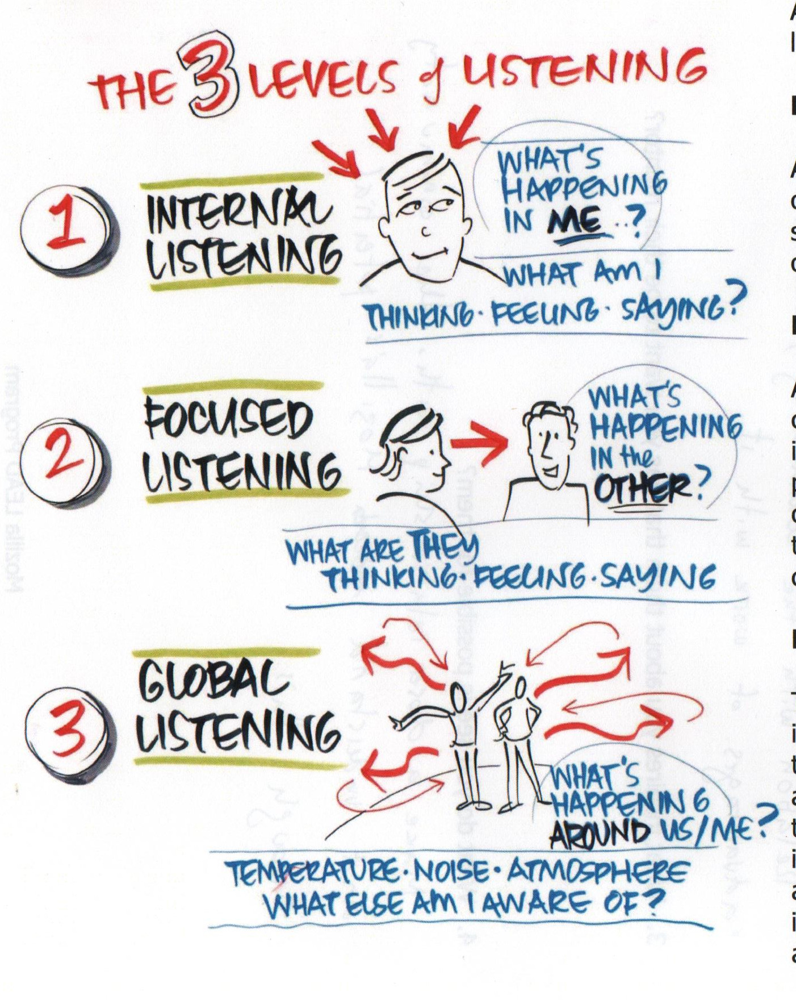

## Three levels of listening

Coaching is mostly made by conversations. Making the right questions so *coachee* could think, reflect and act. But to create the space for those conversations and make the best use of the time, we need to **listen in a special way**. Generally we talk about three different ways in which we could be listening what other people are saying.

### Level 1 - Internal listening

At Level 1, your awareness is on yourself. You listen to the words of the other person, but your attention is on what it means to you. The spotlight is on 'me': my thoughts, my judgments, my feelings, my opinions, an my conclusions. If this is the only kind of listening you’re doing in a conversation, others will often leave frustrated or disappointed, feeling neither seen nor heard.

### Level 2 - Focused listening

At Level 2, there is a sharp focus on the other person. Sometimes you can see it in each person's posture: both leaning forward, looking intently at each other. There is a great deal of attention on the other person and not much awareness of the outside world. You listen for the other's person words, meaning, challenges, emotions. you notice what they say and how they say it. Level 2 listening communicates empathy, clarification and collaboration.

It is the skill of being fully absorbed by the person in front of you, to the exclusion of all other things, including anything in Level 1. This doesn’t mean that Level 1 thoughts don’t come into your awareness. Of course they do! Rather, it means managing your Level 1 thoughts and reactions by quietly noting them and quickly setting them aside to keep your focus and curiosity on the other person.

In Level 2, you’re never thinking ahead to what you want to say next or what you’re going to ask. You stay with the person in this present moment, and trust that the conversation will take on a powerful flow of its own without you having to control it in one direction or another.

### Level 3 - Global listening

To listen at level 3 you must be open and ready to listen for information that may not be directly observable. You are listening to the people as well as the environment. It is sometimes described as environmental listening. It is the ability to read a room -the mood, the emotions, the unspoken information- and monitor how it changes in response to what you do. *Is there tension in the air? Is the conversation flat, or full of resonance? What are the primary emotions hanging in space between us? What’s hanging out there in the space between us that’s not being said?*.

There is a way you are conscious of underlying mood, or tone, or the impact of the conversation — where it is taking you and the person you are talking to.

The most effective coaching takes place when **the coach is at Level 2 and 3**. There will be times when coaches will drop into their own Level 1 place. As a coach, the key is to notice when you are listening at Level 1 and find your way back “over there” with the client. Sometimes all it takes is asking a provocative, curious question.

**Once you know the three levels, incorporating them into your life is simply a matter of practice.**

### Infographic

This image will help you to remember these three different levels:

Source: Co-Active Coaching By Laura Whitworth, Karen Kimsey-House, Henry Kimsey-House and Phillip Sandahl

### Links

* [The 3 levels of listening](http://michaelwarden.com/the-3-levels-of-listening/)
* [Co-Active coaching skills: Listening](http://www.thecoaches.com/learning-hub/fundamentals/res/FUN-Topics/FUN-Co-Active-Coaching-Skills-Listening.pdf)
