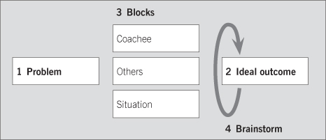

## How to run a super quick coaching session

Sometimes you do not have the time or knowledge to complete a full coaching discussion and really build someone’s skills, but you do want to help someone who is ‘stuck’ to complete the task in question.

Using the model shown opposite, you can achieve this in as little as five minutes by helping your coachees to see that they themselves have some responsibility for the situation and that there is something they can do, however small.

1. Ask the coachee to describe the current issue or problem, with specific examples and a small amount of relevant background.
2. Ask her/him to describe the outcome – paint as specific a ‘picture’ as possible of how things would be if s/he had sorted out the problem. Do not try to solve the problem, but note down any emerging ideas.
3. With the coachee, list all the obstacles/blocks that lie between 1 and 2. Sort them into three groups:
  * Blocks that exist in the coachee (lack of skill/knowledge, low motivation, attitude, etc.)
  * Blocks that exist in others (anxious customer, manager stressed and panicking, etc.)
  * Blocks in the situation (inadequate resources, shift in deadlines, etc.).
4. Jointly brainstorm ways around these blocks, and possible next steps. Agree an approach, actions and timing.

